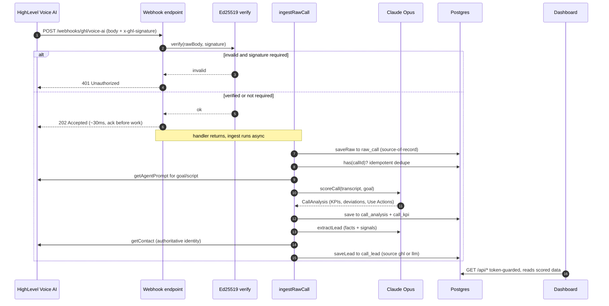

# `server/` — Backend (Express + TypeScript)

The analytical brain **and** the HighLevel integration surface. It ingests Voice AI call
transcripts, scores them against each agent's goals with an LLM, detects deviations / missed
opportunities / "Use Actions", extracts lead facts + observability signals, persists everything
to Postgres, synthesizes cross-call recommendations, and serves it all (plus the built SPA) over
one HTTP origin.

> Big-picture architecture, decisions, and the Team-of-One split live in the [root README](../README.md)
> and [`docs/`](../docs). This file is the backend's own map.

## Quick start

```bash
cp ../.env.example ../.env   # fill CLIENT_ID/SECRET, DATABASE_URL, CLAUDE_CODE_OAUTH_TOKEN, …
npm install
npm run dev        # tsx watch on :8095 (creates tables on boot if DATABASE_URL is set)
```

| Script | What |
|--------|------|
| `npm run dev` | `tsx watch src/index.ts` — hot-reloading dev server |
| `npm run start` | `tsx src/index.ts` — production run (what pm2 runs) |
| `npm run typecheck` | `tsc --noEmit` |
| `npm run test` | `vitest run` — unit + Postgres integration suite |

## Architecture

Three responsibilities, cleanly separated:

```
                ┌─────────────────────── HTTP (index.ts, :8095) ───────────────────────┐
   GHL webhook ─┤ /webhooks  VoiceAiCallEnd → Ed25519 verify → ingest (202, async)      │
   OAuth ───────┤ /oauth     install / callback / token refresh                          │
   Dashboard ───┤ /api       read API (token-guarded) ── + serves web/dist (SPA)         │
                └──────────────────────────────────────────────────────────────────────┘
```

### The ingestion pipeline (the "Validation Flywheel")

`ingest/ingestCall.ts` orchestrates one call end-to-end. A `VoiceAiCallEnd` webhook (primary) or
the poll backfill (`pollIngest.ts`) both funnel into `ingestRawCall()`:

```
raw call ─▶ rawCallRepo.saveRaw()         # 1. source-of-record FIRST (survives a scoring crash)
         ─▶ scoreCall()  ── llm/agent ──▶ # 2. KPI scores + deviations + Use Actions  (Claude, structured output)
            analysisRepo.save()           #    → call_analysis (+ flat call_kpi rows for GROUP BY)
         ─▶ ingestLead()                  # 3. lead facts + the two signals
              ├─ nativeFacts()            #    native GHL extractedData (ground-truth)  ─┐ hybrid:
              ├─ extractLead() (Claude)   #    LLM extraction (fallback)                 ├ native facts,
              ├─ getContact() (GHL)       #    authoritative identity                   ─┘ LLM signals
              └─ leadRepo.saveLead()      #    → call_lead (source = 'ghl' | 'llm')
```

The webhook handler acks **202 in ~30ms** then ingests asynchronously (GHL retries slow handlers;
an in-flight set + idempotent `analysisRepo.has()` dedupe retries).

#### Webhook call sequence



### Recommendations (on demand)

`analysis/recommend.ts` gathers an agent's stored analyses + KPI averages and runs an Opus
synthesis (`agent_recommendations`, cached by agent + scored-call count; auto-invalidates when new
calls arrive). Served at `GET /api/recommendations`.

### Persistence (Postgres, no ORM)

Hand-written SQL through a `pg` pool (`db/pool.ts`, schema created on boot). Swappable repository
interfaces (`store/*`) keep storage behind a seam. **Full table-by-table reference:
[`src/db/SCHEMA.md`](./src/db/SCHEMA.md).**

| Table | Owner | Holds |
|-------|-------|-------|
| `raw_call` | `rawCallRepository` | the **source-of-record** transcript/metadata, written on arrival |
| `call_analysis` | `analysisRepository` | the LLM scoring output (KPIs, deviations, Use Actions) — FK → raw_call |
| `call_kpi` | `analysisRepository` | flat (agent, kpi, score) rows for `GROUP BY` averages |
| `call_lead` | `leadRepository` | lead facts + `missed_opportunity` / `human_action_needed` signals — FK → raw_call |
| `agent_recommendations` | `analysisRepository` | cached cross-call synthesis |
| `oauth_tokens` | `tokenStore` | per-install OAuth access/refresh tokens |

### LLM layer

`llm/agent.ts` wraps the **Claude Agent SDK** (`runStructured`, `claude-opus-4-8`) — a single-turn,
structured-output "LLM-judge" call (no tool loop), authed by `CLAUDE_CODE_OAUTH_TOKEN` (not a bare
API key). Used by `score.ts`, `extractLead.ts`, and `recommend.ts`.

## Directory map

```
src/
  index.ts            app wiring: CSP for iframe embed, routers, static SPA, API-token injection
  config.ts           env → typed config (loads ../.env)
  routes/             api.routes · oauth.routes · webhook.routes
  middleware/         apiAuth — bearer/x-api-key guard for /api (constant-time)
  ingest/             ingestCall (pipeline) · pollIngest (backfill)
  analysis/           transcript · kpis · score · extractLead · nativeFacts · recommend · types
  store/              rawCallRepository · analysisRepository · leadRepository · tokenStore
  llm/agent.ts        Claude Agent SDK wrapper (structured output)
  ghl/                api (GHL REST: call logs, agents, contacts) · oauth (token exchange/refresh)
  webhooks/verifyGhl  Ed25519 signature verification
  db/pool.ts          pg pool + schema
scripts/              one-shot ops: ingest, backfill, configure-agent, migrate-*, score-fixture
```

## Environment

| Var | Purpose |
|-----|---------|
| `CLIENT_ID` / `CLIENT_SECRET` | Marketplace app OAuth credentials |
| `PUBLIC_BASE_URL` | builds the OAuth redirect URI + Custom Page URL |
| `PORT` | listen port (default 8095) |
| `SCOPES` | OAuth scopes (subset of what the app enables) |
| `DATABASE_URL` | Postgres; empty → persistence disabled |
| `CLAUDE_CODE_OAUTH_TOKEN` | Claude Agent SDK auth (`claude setup-token`) |
| `WEBHOOK_REQUIRE_SIGNATURE` | `true` → reject unsigned webhooks (401) |
| `API_AUTH_TOKEN` | bearer token guarding `/api/*` (injected into the served SPA) |

## Conventions

- **Source-of-record first:** `raw_call` is written before scoring, so a scoring failure never
  loses a call (re-ingest replays from it).
- **Hybrid lead extraction:** identity/booking **facts** prefer native GHL `extractedData`; the two
  **signals** are always LLM (GHL records successes, not gaps). `source` flag keeps provenance honest.
- **Structured-output LLM only:** every model call is schema-constrained — no free-form parsing.
- **No ORM** (ADR-0008): explicit SQL + swappable repositories.
- **Auth surfaces:** `/api` = bearer token · `/webhooks` = Ed25519 signature · `/oauth` = the OAuth flow.

See [`docs/decisions`](../docs/decisions) (ADRs) and [`docs/functional-vs-mocked.md`](../docs/functional-vs-mocked.md).
